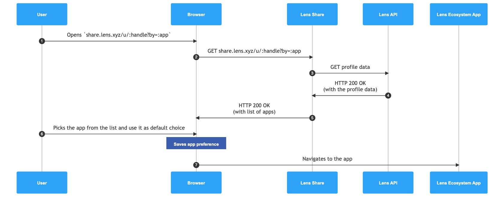
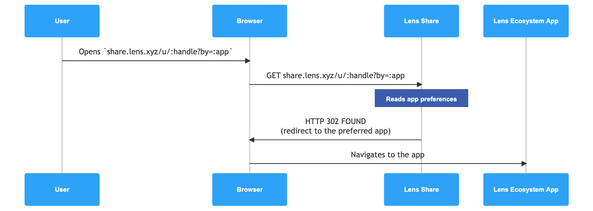

title: Lens Share
description: A standard to share Lens profiles and publications across the Lens ecosystem
author: Paweł Lula (@desfero), Cesare Naldi (@cesarenaldi), Kris Urbas (@krzysu)
status: Draft
type: Lens Ecosystem Standard
created: 2023-06-07

## Abstract

The increasing number of Lens ecosystem apps necessitates the ability to share URLs to publications and profiles in an app-agnostic manner, allowing users to utilize their preferred apps. However, there are instances where the user's preferred app may not be available on the current platform, creating a need to enhance the user experience by providing the option to choose from the available apps. This proposal examines the implementation of a standardized link-sharing strategy and an app-agnostic interface, facilitating seamless integration among apps in the Lens ecosystem while preserving attribution to the original app.

## Motivation

Currently in order to share a URL one needs to copy & paste a very Lens app-specific URL format. This is not necessarily portable as different apps live on their own domains and implement different routing strategies.

Some Lens applications are just mobile-only or web-only. So opening a URL on one of these platforms could lead the user to a dead-end.

In the case the user opens a link leading to a new Lens app, the initial login overhead plus the cognitive load required to understand the new UI, easily leads to losing focus on the original objective (opening the link). This is a suboptimal UX for the entire Lens ecosystem.

By introducing a common standard to share Lens links, this proposal aims at:

- simplify the share links process by defining a portable URL format
- provide attribution to the original app used to generate the link
- provide reliable embed metadata for social media link previews

## Specification

In order to function there are 3 elements:

- a Lens App registry
- a portable Lens Share link format
- a Lens Share UI responsible to handle the link and give options to the user

### Lens Share Registry

Define a Lens ecosystem apps registry that allows a builder to register their app details such as name, icon, supported platforms, app-specific URL formats, etc.

In order to do that this proposal defines the JSON schema of a Lens App Manifest that must be used to register a new app.

An example:

```json
{
  "shortname": "foobar",
  "name": "Foo Bar",
  "description": "Lorem ipsum dolor sit amet, consectetur adipiscing elit, sed do eiusmod tempor incididunt ut labore et dolore magna aliqua. ",
  "icon": "https://example.com/icon.png",
  "image": "https://example.com/image.png",
  "platforms": ["mobile", "web"],
  "mappings": {
    "mobile": {
      "home": "com.foobar://home",
      "profile": "com.foobar://user/:handle",
      "publication": "com.foobar://publication/:id"
    },
    "web": {
      "home": "http://example.com/",
      "profile": "http://example.com/u/:handle",
      "publication": "http://example.com/p/:id"
    }
  },
  "tags": ["foo", "bar", "social"]
}
```

The `:handle` and `:id` tokens represent placeholder for where the app expect Profile handles and Publication Ids. The specification could be extended to support Profile Ids if need to.

The app manifest should be submitted as PRs to the registry repository and there should be a process in place to validate and approve new apps.

### Lens Share Link

Lens apps should adopt a common link format such as:

- `https://share.lens.xyz/u/<handle>` for Profiles
- `https://share.lens.xyz/p/<publication-id>` for Publications

The URL could also include an attribution parameter that allows to give visibility of the originating app.

Some examples:

```
https://share.lens.xyz/u/stani.lens?by=lenster

https://share.lens.xyz/p/0x01-0x01?by=orb
```

### Lens Share UI

The Lens Share UI is the one responding to `https://share.lens.xyz` requests. It should render a simple Lens-branded interface that for the given URL and the current user's platform, shows a list of apps to pick from.

Once the app is chosen it will automatically redirect to the given app with the app-specific URL details required to open the linked resource (Profile or Publication).



The sequence of events is:

- 1. The user clicks on an `https://share.lens.xyz` link
- 2. The user's browser performs a GET HTTP request for the aforementioned URL
- 3. Lens Share app queries the Lens API for, in this example, profile data
- 4. Lens API returns the given profile data
- 5. Lens Share app returns a list of apps relevant to the requesting browser (e.g. offer mobile apps to mobile browsers but not to desktop browsers).
- 6. Use selects one of the options
- 7. The user's browser follows the resolved app-specific URL

If the link includes attribution details (e.g. `?by=phaver` param) such information will be used to clearly communicate the original app used to generate the link. This is with clear app messaging as well as boosting priority to the app in the list.

The user could express a preference to open any future links using the same app or "just once". Opening a new link will result in an immediate redirect to the chosen app. Such preference will be stored in the device using a simple cookie so that the redirect can happen with an efficient HTTP 302.



The sequence of events in this case is:

- 1. The user clicks on an `https://share.lens.xyz` link
- 2. The user's browser performs a GET HTTP request for the aforementioned URL
- 3. The Lens Share app understands the user preference and responds with a 302 HTTP redirect
- 4. The user's browser follows the resolved app-specific URL

Opening the Lens Share UI at `https://share.lens.xyz` should provide an option to reset the user's preference.

The Lens Share UI will also implement industry standards such as OEmbed and OG tags so that shared links on social media could render rich URL previews. If the `by` attribution parameter is present the metadata could include incorporate elements of the app manifest to make the originating app brand surface in the preview. This could evolve over time into theming settings.

## Rationale

When evaluating if the Lens Share UI should be exposed over HTTP we entertained the idea of using a custom scheme such as `lens://`. This is a very interesting idea in the context of a web3 protocol but requires time for submitting the corresponding scheme specification to the IANA and it does require adoption from user agents. In the meantime, an HTTP fallback strategy is anyway needed, so while this proposal does not exclude a future `lens://` it focuses on what is achievable today in times compatible with web3.

## Security Considerations

### Malicious apps

A reasonable security concern is around the process that allows apps to be added to the Lens Share Registry.
Currently, a similar validation process is in place for accepting apps to be listed under https://www.lens.xyz/apps.

We should have a strict process here as well so that only apps from legit builders are included.

### URL sanitization

Strict validation and sanitization rules should be applied to incoming requests to avoid malicious URLs from impacting the user experience.

## Copyright

Copyright and related rights waived via CC0.
